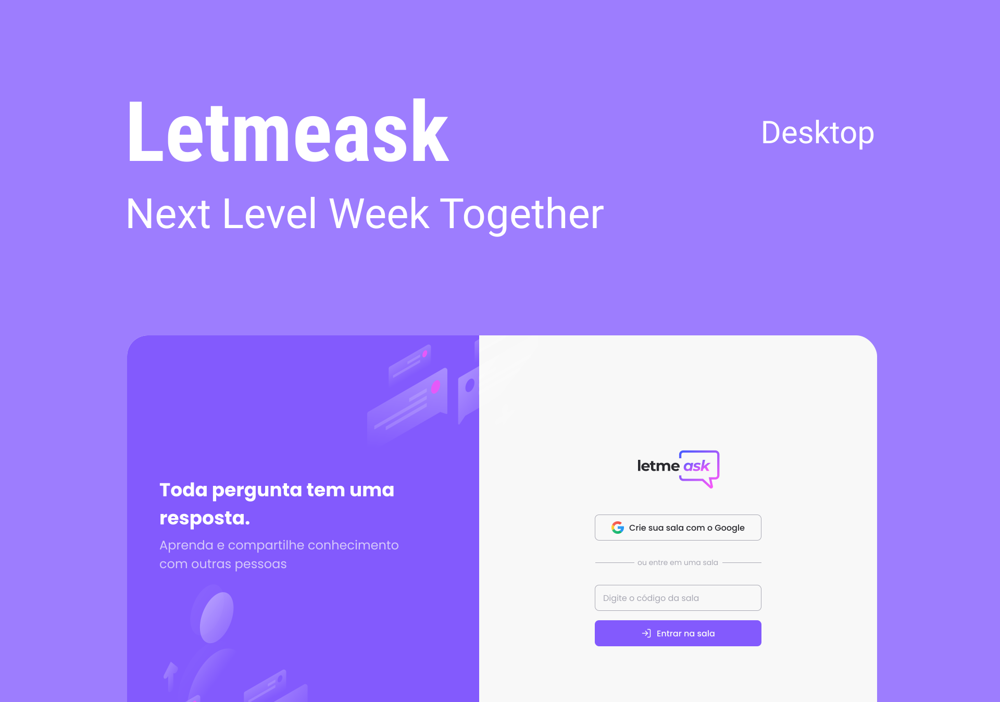

  <p align="center">
  
</p>

<p align="center">
  
  
  

     
</p>

<h1 align="center">
  
</h1>

<br />

## 💻 Projeto

Letmeask é perfeito para criadores de conteúdos poderem criar salas de Q&A com o seu público, de uma forma muito organizada e democrática.

## 🧪 Tecnologias

Esse projeto foi desenvolvido com as seguintes tecnologias

- [ReactJS](https://reactjs.org)
- [Firebase](https://firebase.google.com/)
- [TypeScript](https://www.typescriptlang.org/)

## 🚀 Como executar

Antes de começar a executar esse projeto é necessário ter o [Node.js](https://nodejs.org/) e o [Git](https://git-scm.com) instalado na sua máquina

Primeiro você deve clonar esse repositório e entre na pasta desse repositório que havia sido clonado, caso você não queira seguir esse passo você pode baixar esse repositório em arquivo .zip nesse link [download .zip](https://github.com/pduartesilva2005/nlw-06-reactjs/archive/refs/heads/main.zip)

```bash
$ git clone https://github.com/pduartesilva2005/nlw-06-reactjs
$ cd nlw-06-reactjs
```

Para iniciá-lo, siga os passos abaixo:

```bash
# Instalar as dependências
$ yarn

# Iniciar o projeto
$ yarn start
```

O app estará disponível no seu browser pelo endereço http://localhost:3000.

Lembrando que será necessário criar uma conta no [Firebase](https://firebase.google.com/) e um projeto para disponibilizar um Realtime Database.

## 📝 License

Esse projeto está sob a licença MIT. Veja o arquivo [LICENSE](.github/LICENSE.md) para mais detalhes.

---

Feito com 💜 by Pedro Duarte 👋🏻
